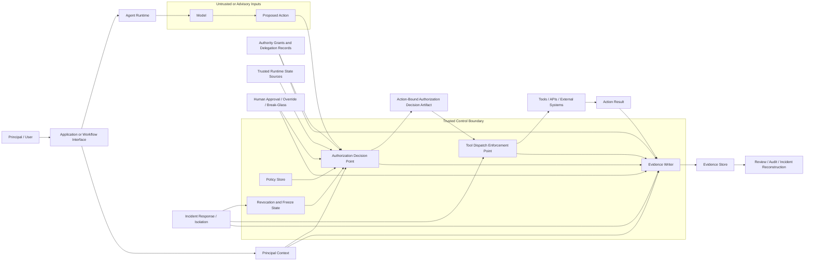

# 17. Reference Architecture

## Status

This document is a reference architecture for AAEF v0.2 public review.

It is not a required implementation architecture and does not mandate specific vendors, protocols, runtimes, policy engines, databases, or identity systems.

The purpose is to show how AAEF concepts can be represented in an implementable system design while preserving the core principle:

> Model output is not authority.

Related diagram source:

- `assets/aaef-reference-architecture.mmd`

## Design Goals

The reference architecture is intended to:

- separate model output from authorization,
- enforce action boundaries at tool dispatch,
- bind authorization decisions to specific actions where feasible,
- preserve principal and delegation context,
- produce structured evidence,
- support approval, override, break-glass, revocation, freeze, and isolation,
- and clarify the trusted control boundary required for AAEF controls to function.

## High-Level Diagram

## Core Components

### Principal / User

The principal is the human, service, organization, or upstream actor on whose behalf the agentic action is performed.

AAEF requires high-impact actions to be bound to a principal where applicable.

Relevant controls:

- `AAEF-PRN-01`
- `AAEF-PRN-02`

### Application or Workflow Interface

The application or workflow interface captures the user's request, business process context, session context, workflow state, and relevant principal context.

This component should not simply pass natural-language intent into authorization as a trusted fact.

It should preserve trusted references such as:

- session identity,
- request ID,
- workflow ID,
- ticket ID,
- business process ID,
- policy context,
- and delegated authority references.

### Agent Runtime

The agent runtime coordinates model calls, tool planning, memory retrieval, and workflow execution.

AAEF does not require a specific runtime, framework, or agent orchestration system.

However, the runtime should not be the only place where high-impact authorization is enforced if the model can influence or bypass runtime behavior.

### Model

The model may generate reasoning, plans, explanations, tool call proposals, or action arguments.

In AAEF, the model is not treated as an authority source.

Model output may be useful as advisory context, but high-impact authorization should rely on trusted policy, structured authority grants, principal binding, trusted runtime state, and enforcement components.

### Proposed Action

The proposed action is the model or runtime's requested operation.

Examples:

- send an external email,
- export a file,
- create a purchase order,
- change access rights,
- modify production configuration,
- invoke a security containment action,
- write persistent memory,
- delegate authority to another agent.

A proposed action should be normalized into a structured action request before authorization where feasible.

Recommended fields include:

- action type,
- target resource,
- principal,
- requested scope,
- purpose reference,
- tool or API,
- high-impact category,
- expected side effect.

## Trusted Control Boundary

AAEF depends on a trusted control boundary.

The trusted control boundary is the set of components that must be trusted enough to enforce policy and produce evidence.

A minimal boundary may include:

- Authorization Decision Point,
- Tool Dispatch Enforcement Point,
- Evidence Writer,
- Policy Store,
- Revocation and Freeze State.

Other deployments may also include:

- identity provider,
- delegation verifier,
- approval workflow,
- tamper-evident evidence store,
- runtime state provider,
- secure workflow engine.

If these components are compromised, bypassed, or implemented inside a model-controlled path, AAEF control effectiveness may be reduced.

## Authorization Decision Point

The Authorization Decision Point evaluates whether a high-impact action may proceed.

Inputs may include:

- principal context,
- authority grants,
- delegation records,
- policy references,
- high-impact action category,
- runtime state,
- revocation or freeze state,
- approval requirements,
- evidence requirements.

The Authorization Decision Point should not rely solely on:

- agent-inferred purpose,
- model-generated justification,
- untrusted natural-language content,
- or model self-assessment.

Relevant controls:

- `AAEF-AUZ-01`
- `AAEF-AUZ-02`
- `AAEF-AUZ-04`
- `AAEF-AUZ-05`
- `AAEF-AUZ-06`
- `AAEF-AUZ-07`
- `AAEF-AUZ-08`
- `AAEF-AUZ-09`

### Boundary Hardening for High-Impact Actions

For high-impact actions, the trusted control boundary should be designed so that model-influenced components cannot bypass authorization, dispatch enforcement, or evidence generation.

In particular:

- the Tool Dispatch Enforcement Point should be treated as the required execution path for high-impact tool, API, or workflow execution;
- high-impact tools and backend APIs should reject calls that do not originate from an approved Tool Dispatch Enforcement Point or equivalent enforcement gateway;
- high-impact tool credentials should not be exposed to the model, prompt context, memory, RAG context, or untrusted Agent Runtime;
- evidence for high-impact actions should not depend only on Agent Runtime self-reporting;
- natural-language prompting, model instruction, or model self-restraint alone should not be treated as policy enforcement for high-impact action authorization.

A trusted control boundary is weakened if the Agent Runtime can directly invoke high-impact tools using credentials that bypass the Tool Dispatch Enforcement Point.

## Action-Bound Authorization Decision Artifact

For high-impact actions, an authorization decision should be bound to the specific action where feasible.

A decision artifact may include:

- decision ID,
- decision value,
- bound action digest,
- principal ID,
- authority scope,
- resource,
- issuer,
- expiration,
- signature or integrity reference.

This helps reduce the risk that an authorization decision for one action is replayed or reused for another action.

Related schema section:

- `authorization.authorization_decision_artifact`

### Canonical Action Request

For high-impact actions, the authorization decision should be bound to a canonical representation of the requested action where feasible.

A Canonical Action Request is a normalized representation used for authorization, dispatch verification, evidence correlation, and replay resistance.

Recommended fields include:

- schema version,
- action ID,
- agent ID,
- agent instance ID,
- principal ID,
- authority scope,
- tool name,
- tool operation,
- target resource,
- purpose reference,
- high-impact category,
- expected external effect,
- normalized argument digest,
- policy ID,
- policy version,
- relevant approval ID if approval is required,
- relevant runtime state references,
- issued timestamp,
- expiration timestamp,
- nonce or single-use marker.

The Tool Dispatch Enforcement Point should verify that the authorization decision artifact applies to the same Canonical Action Request that is about to be executed.

If the tool operation, resource, principal, authority scope, arguments, approval context, policy version, expiration, or revocation state changes, the previous authorization decision should not be reused without reauthorization.

## Tool Dispatch Enforcement Point

The Tool Dispatch Enforcement Point is the component that actually allows or blocks tool execution.

For high-impact actions, the Tool Dispatch Enforcement Point should be treated as a required choke point, not merely as an optional wrapper around model-generated tool calls.

The Tool Dispatch Enforcement Point should fail closed for high-impact actions when required authorization, approval, revocation, or evidence checks cannot be completed.

It should enforce the authorization decision, not merely trust the model's tool call.

It should verify that:

- the decision applies to the same action,
- the decision has not expired,
- the resource and scope match,
- the principal and agent context match,
- any required approval or verification has occurred,
- revocation or freeze state does not block execution,
- the authorization decision artifact or dispatch attestation was issued by an approved component,
- the decision has not already been used when single-use semantics are required,
- the policy version is acceptable for the action being executed,
- the canonical action digest matches the current tool invocation.

This is where AAEF's separation between proposed action and permitted action becomes operational.

High-impact backend APIs and tools should act as relying parties for dispatch enforcement.

Where feasible, they should verify an authorization decision artifact, dispatch attestation, or equivalent enforcement signal before performing high-impact effects.

This reduces the risk that an Agent Runtime, SDK wrapper, queue worker, or compromised integration path directly invokes a high-impact backend API without passing through the intended enforcement boundary.

Relevant controls:

- `AAEF-TOOL-01`
- `AAEF-TOOL-02`
- `AAEF-TOOL-03`
- `AAEF-TOOL-04`

## Policy Store

The Policy Store contains machine-enforceable authorization policy, approval thresholds, delegation constraints, high-impact action classifications, and other relevant policy references.

Human-readable policy summaries may support review, but should not replace machine-enforceable policy references for high-impact authorization.

## Trusted Runtime State Sources

Some high-impact actions depend on runtime state.

Examples:

- revocation state,
- incident status,
- system health,
- vendor status,
- account status,
- fraud risk,
- market state,
- deployment window,
- approval status.

AAEF does not require specific state providers.

Organizations should define which runtime state sources are trusted for each high-impact action category.

Relevant control:

- `AAEF-AUZ-07`

## Revocation and Freeze State

AAEF requires revocation, freeze, isolation, and response behavior to be defined, evidenced, and testable.

It does not assume instantaneous global revocation in distributed systems.

Implementations should distinguish:

- future-action denial,
- in-flight action handling,
- downstream delegation propagation,
- partial authority freeze,
- credential revocation,
- tool access revocation,
- workflow isolation.

Relevant controls:

- `AAEF-RES-01`
- `AAEF-RES-02`
- `AAEF-RES-03`
- `AAEF-RES-04`

## Evidence Writer

The Evidence Writer produces structured evidence for high-impact actions.

Evidence may include:

- agent identity,
- principal,
- action,
- resource,
- authority scope,
- delegation lineage,
- authorization decision,
- state checks,
- approval,
- result,
- non-execution decision,
- reauthorization request,
- override event,
- timestamps,
- evidence hash or integrity reference.

The Evidence Writer should not rely solely on model-generated explanations for high-assurance evidence assertions.

Relevant controls:

- `AAEF-EVD-01`
- `AAEF-EVD-02`
- `AAEF-EVD-03`
- `AAEF-EVD-04`
- `AAEF-EVD-05`
- `AAEF-EVD-06`

## Evidence Store

The Evidence Store stores or references evidence events.

AAEF does not require a specific storage system.

Possible implementations include:

- append-only logs,
- SIEM,
- audit database,
- object storage with retention lock,
- transparency log,
- signed evidence bundle,
- WORM storage,
- versioned records.

For high-impact actions, evidence integrity and retention expectations should be documented.

## Human Approval, Override, and Break-Glass

AAEF distinguishes normal approval from exceptional intervention.

Normal approval supports pre-action decision-making.

Human override or break-glass may involve:

- emergency stop,
- manual reversal,
- forced continuation,
- temporary authority grant,
- incident-driven bypass,
- privileged intervention.

Override and break-glass events should be append-only and linked to original actions or incidents.

Relevant controls:

- `AAEF-HUM-01`
- `AAEF-HUM-02`
- `AAEF-HUM-03`
- `AAEF-HUM-04`

### High-Impact Action Review Surface

AAEF does not prescribe a specific user interface for human approval or review.

A review surface may be a web UI, CLI confirmation prompt, approval workflow, ticket, change request, policy review screen, or another mechanism that presents a high-impact action for review before execution.

For high-impact actions, the review surface should make the reviewed action clear enough for the approver or reviewer to understand what is being authorized.

Where applicable, the review surface should expose or reference:

- the principal,
- the agent or agent instance,
- the canonical action,
- the action type,
- the target resource,
- the tool or backend operation,
- the authority scope,
- the expected external effect,
- the risk level or high-impact category,
- the applicable policy decision,
- any required approval or override reason,
- the action or argument digest,
- the expiration or revocation state,
- and the evidence reference or correlation ID.

The approval should be bound to the canonical action that is actually dispatched or executed.

A human-readable summary alone is not sufficient if the executed action can differ from what the approver reviewed.

If the reviewed action, approved action, dispatched operation, and executed backend effect are not bound together, the system may be vulnerable to approval laundering, payload substitution, replayed authorization artifacts, or action digest mismatch.

AAEF does not require a particular review UI implementation. However, high-impact action review surfaces should make the boundary between proposed action, permitted action, dispatched operation, executed effect, and recorded evidence visible enough to support meaningful approval and later review.

## Incident Response and Isolation

Incident response may update revocation state, freeze authority, isolate agents, block tools, or trigger reconstruction.

Evidence should preserve:

- what was revoked or frozen,
- who initiated response,
- affected agents,
- affected delegations,
- in-flight actions,
- downstream actions,
- and reconstruction references.

## Common Deployment Patterns

### Implementation Profile Summary

| Component | MVP placement | Strong placement | Anti-pattern |
|---|---|---|---|
| Authorization Decision Point | Runtime middleware or policy service | External authorization service with trusted policy and state inputs | Model self-check or natural-language policy prompt only |
| Tool Dispatch Enforcement Point | Tool wrapper for controlled tools | Gateway, backend enforcement layer, or dedicated dispatch service | Logging-only wrapper that can be bypassed |
| High-impact credentials | Held by TDE or backend API | Vault-backed short-lived credentials issued only to enforcement components | Agent Runtime owns broad API keys |
| Evidence Writer | TDE writes structured evidence | Independent evidence pipeline fed by ADP, TDE, and backend execution paths | Agent self-reports success or failure only |
| Backend API / Tool | Receives requests through TDE | Verifies dispatch attestation or action-bound authorization artifact | Accepts direct calls from Agent Runtime using shared credentials |
| Human approval | Approval linked to action ID | Approval bound to canonical action digest and verified at dispatch | Human-readable summary approval only |

### Pattern A: Same-Process Prototype

In a prototype, the model, runtime, policy check, and tool call may all run in one process.

This can be useful for experimentation, but the trusted control boundary is weak.

Risk:

- model-influenced code paths may bypass authorization,
- evidence may be self-reported,
- tool dispatch may not be independently enforced.

Recommended use:

- demos,
- local testing,
- low-impact actions only.

Same-process implementations should not be used for production high-impact actions unless compensating controls demonstrate that model-influenced code cannot bypass authorization, dispatch enforcement, or evidence generation.

### Pattern B: Runtime-Enforced Agent Application

The model proposes actions, but the runtime enforces policy before tool invocation.

This is a stronger pattern if the runtime is trusted and not model-controlled.

Risk:

- runtime bugs may still bypass enforcement,
- policy and evidence may be incomplete.

Recommended use:

- controlled internal agents,
- moderate-risk workflows,
- early production with limited tool scope.

### Pattern C: External Authorization and Dispatch Gateway

The model and agent runtime cannot directly call high-impact tools.

All high-impact tool calls pass through a gateway that verifies authorization and records evidence.

This is usually stronger for enterprise use.

Risk:

- gateway policy may be incomplete,
- integration complexity increases,
- latency and operational cost may increase.

Recommended use:

- high-impact actions,
- production systems,
- regulated or sensitive workflows.

In this pattern, high-impact credentials should be held by the gateway, backend API, or another trusted enforcement component, not by the Agent Runtime.

Backend APIs and tools should reject high-impact requests that do not carry a valid dispatch attestation, action-bound authorization decision artifact, or equivalent enforcement proof.

### Pattern D: Cross-Domain Agent Interaction

One organization, system, or agent domain requests action from another.

This requires additional attention to:

- issuer identity,
- operator identity,
- authority assertion,
- delegation constraints,
- revocation checks,
- evidence verification,
- cross-domain trust.

AAEF does not require a specific cross-domain credential technology at this stage.

## Implementation Neutrality

AAEF does not require a new tool runtime, identity system, authorization stack, or dispatcher.

The reference architecture can be implemented using existing enforcement mechanisms, including:

- operating system users or Unix UIDs,
- service accounts,
- cloud workload identities,
- enterprise IAM identities,
- API gateways,
- IAM policy enforcement,
- OPA, Cedar, or similar policy engines,
- workflow runners,
- container or serverless isolation boundaries,
- CLI wrappers,
- backend service enforcement layers,
- and existing audit or evidence pipelines.

Pseudocode such as `dispatch_tool(tool_call)` and schema fields such as `principal` are abstract representations of the control boundary and evidence model. They are not intended to require a new tool execution platform or a new identity model.

In a concrete implementation, the principal may be an existing user, service account, GitHub Actions actor, workload identity, Unix UID, or enterprise IAM subject.

The key AAEF requirement is not the specific mechanism. The key requirement is that a model-generated action is treated as a proposed action, not authority by itself.

For high-impact actions, the implementation should make the boundary between proposed action, permitted action, dispatched operation, executed effect, and recorded evidence explicit and reviewable.

AAEF does not require:

- a specific LLM,
- a specific agent framework,
- a specific policy engine,
- a specific identity provider,
- a specific log store,
- a specific cloud provider,
- a specific cryptographic protocol,
- or a specific database.

AAEF defines control and evidence expectations.

Implementation choices should be assessed against those expectations.

## Architecture Review Checklist

Reviewers can ask:

- Is model output separated from authorization?
- Is there an explicit Authorization Decision Point?
- Is tool dispatch enforced outside model self-assessment?
- Are authorization decisions bound to actions where feasible?
- Are principal and delegation context preserved?
- Are high-impact actions classified?
- Are trusted policy inputs defined?
- Are runtime state sources defined?
- Is revocation or freeze behavior defined and testable?
- Is evidence structured and reviewable?
- Are evidence assertions sourced and limited?
- Are override and break-glass paths append-only and reviewable?
- Can high-impact actions be reconstructed after an incident?

## Limitations

This reference architecture is illustrative.

It does not prove that an implementation is secure.

It must be used with:

- threat modeling,
- control validation,
- evidence review,
- architecture-specific testing,
- and organization-specific risk assessment.
